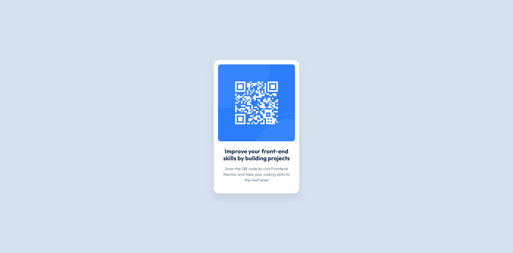

# Frontend Mentor - QR code component solution

This is a solution to the [QR code component challenge on Frontend Mentor](https://www.frontendmentor.io/challenges/qr-code-component-iux_sIO_H). Frontend Mentor challenges help you improve your coding skills by building realistic projects. 

## Table of contents

- [Overview](#overview)
  - [Screenshot](#screenshot)
  - [Links](#links)
- [My process](#my-process)
  - [Built with](#built-with)
  - [What I learned](#what-i-learned)
  - [Useful resources](#useful-resources)
- [Author](#author)

## Overview

### Screenshot

### Links

- [Solution URL](https://github.com/loki-pepe/qr-code-component)
- [Live Site URL](https://loki-pepe.github.io/qr-code-component/)

## My process

### Built with

- Semantic HTML5 markup
- CSS custom properties

### What I learned

While refreshing my memory on HTML and CSS, the idea to use semantic HTML elements instead of generic elements coupled with a myriad of classes was reinforced in me, which helped both the work process and code readability. While still unsure whether my choices for specific HTML elements were appropriate and whether the general structure of my HTML is sound, I am confident this approach was better than my first instinct of using generic divs.

### Useful resources

- [Learn web development by web.dev](https://web.dev/learn) - Their courses on HTML and CSS helped me refresh my basic knowledge and reinforced in me the idea to use semantic HTML elements instead of generic elements coupled with a myriad of classes, which helped both the work process and code readability
- [MDN Web Docs](https://developer.mozilla.org/) - An extensive source on everything HTML and CSS
- [Stack Overflow](https://stackoverflow.com/) - While searching for answers to very specific questions, Stack Overflow helped me resolve some dilemmas and shed some light on encountered problems.

## Author

- GitHub - [Lovro Peraić](https://github.com/loki-pepe)
- Frontend Mentor - [@loki-pepe](https://www.frontendmentor.io/profile/loki-pepe)
